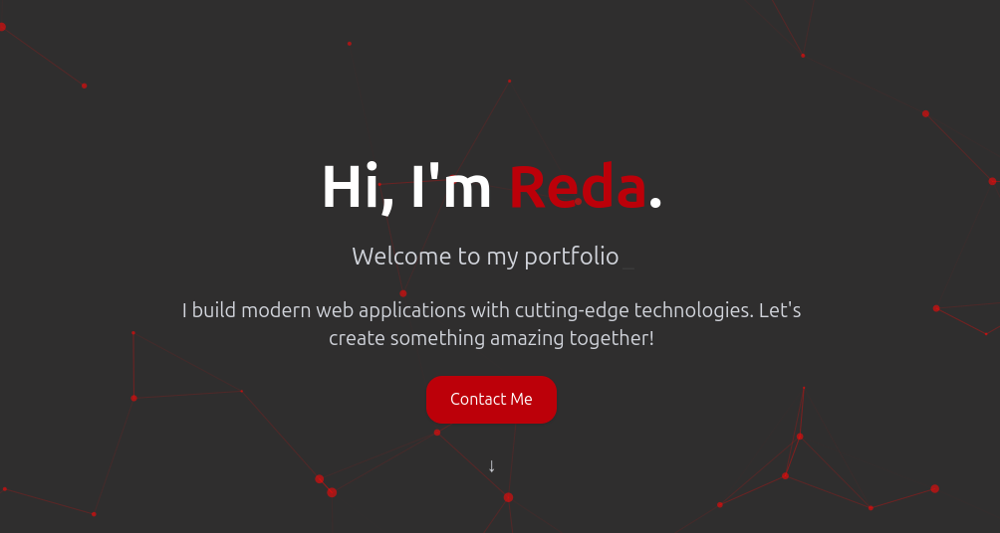

# 🌍 Personal Portfolio Website – redakassoumeh.vercel.app

This is my personal portfolio website, built to showcase my projects, skills, and background as a Full Stack Developer.  
It features a clean, responsive design with bilingual support and smooth user experience.

---

## 📸 Preview



---

## 🎯 Features

- 🧑‍💻 About me section with background and values
- 🧰 Tech stack highlights
- 🚀 Dynamic project showcase
- 🌐 Bilingual support (Arabic + English)
- 📱 Responsive on all screen sizes
- 🔗 Easy access to contact info and social links

---

## 🛠️ Tech Stack

- **Framework:** Next.js 15
- **Language:** TypeScript
- **Styling:** Tailwind CSS, Framer Motion
- **Content:** Contentlayer (Markdown-based content)
- **Hosting:** Vercel

---

## 🧠 Goals Behind the Project

- Centralize my professional identity
- Make it easier for clients and collaborators to understand my work
- Highlight selected projects in a simple, elegant UI

---

## 📂 Folder Structure (optional)

```bash
/components    # Reusable UI elements
/content       # Contentlayer MDX content
/pages         # Next.js routes
/public        # Static assets
/styles        # Global styles
```
